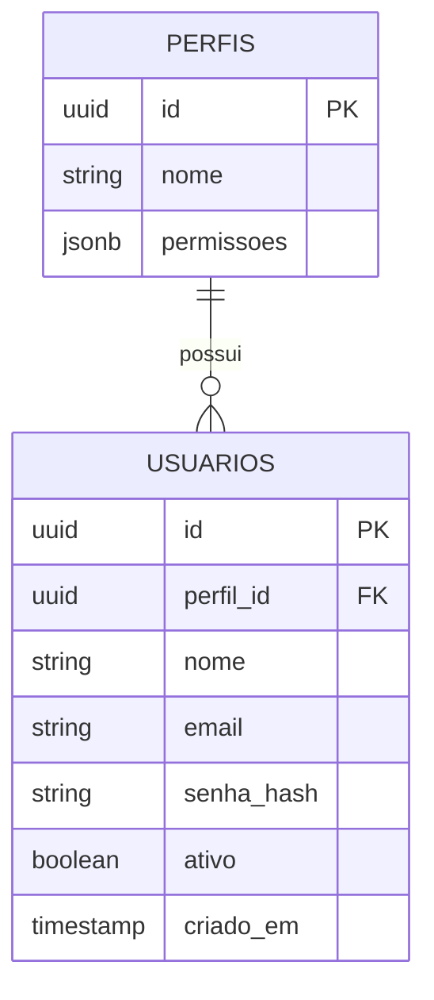
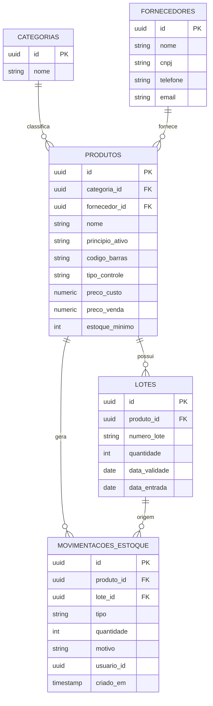
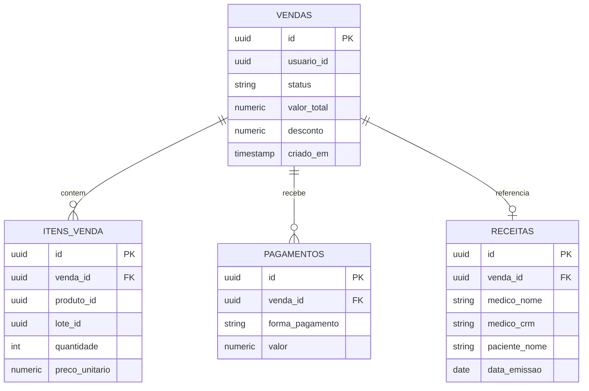
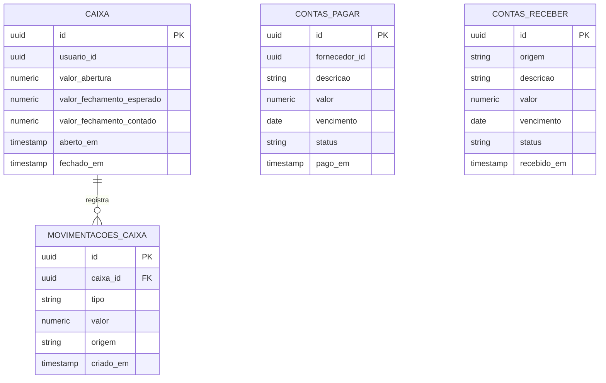
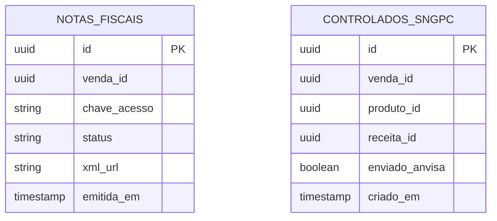

# Arkos — Modelagem de Dados

> Cada serviço tem seu próprio schema lógico no PostgreSQL (ver `docs/ARQUITETURA.md`). Referências entre serviços (ex: `produto_id` dentro de `vendas`) são **por ID apenas — sem FK real entre schemas**, porque um serviço nunca acessa a tabela de outro diretamente, só via API.
>
> Esta modelagem é o ponto de partida para as migrations. `database/schema/` (gerado por `sync-schema.js`) será a fonte de verdade depois que o banco existir de fato.

---

## `auth` (auth-service)

| Tabela | Campo-chave | Observação |
|---|---|---|
| `perfis` | `nome` | operador_caixa, farmaceutico, gerente, administrador (ver `REGRAS-NEGOCIO.md` §7) |
| `usuarios` | `email` (único) | `senha_hash` nunca em texto plano |

---

## `estoque` (estoque-service)

| Tabela | Campo-chave | Observação |
|---|---|---|
| `produtos.tipo_controle` | enum | `livre`, `tarja_vermelha`, `tarja_preta` — define se exige receita (§1) |
| `lotes` | `data_validade` | base da regra **FEFO** — saída sempre pelo lote que vence primeiro (§2) |
| `movimentacoes_estoque.tipo` | enum | `entrada`, `saida`, `ajuste`, `perda`, `devolucao` — toda movimentação é auditada (§2) |

---

## `vendas` (vendas-service)

| Tabela | Campo-chave | Observação |
|---|---|---|
| `vendas.status` | enum | `aberta`, `finalizada`, `cancelada` — cancelamento sempre com motivo (§3) |
| `pagamentos` | 1 venda → N pagamentos | suporta pagamento misto (parte cartão, parte dinheiro) |
| `receitas` | vinculada à venda | obrigatória se algum item for `tarja_vermelha`/`tarja_preta` — sem isso, venda bloqueada (§3) |

---

## `financeiro` (financeiro-service)

| Tabela | Campo-chave | Observação |
|---|---|---|
| `caixa` | abertura/fechamento | fechamento sempre confere esperado x contado (§5) |
| `movimentacoes_caixa` | gerada automaticamente | toda venda finalizada gera lançamento — nunca manual (§5) |

---

## `fiscal` (fiscal-service)

| Tabela | Campo-chave | Observação |
|---|---|---|
| `notas_fiscais` | `status` | no MVP fica mockado (`simulado`), estrutura pronta pra integrar provedor real depois (§6) |
| `controlados_sngpc` | `enviado_anvisa` | fica `false` no MVP — campo já existe para quando a integração real for feita |

---

## Convenções gerais

- Toda tabela usa `uuid` como chave primária (evita conflito ao gerar IDs em serviços diferentes sem coordenação central).
- Datas de auditoria (`criado_em`, etc.) em `timestamp with time zone`.
- Nenhuma FK cruza schemas de serviços diferentes — só dentro do mesmo serviço.
- Campos monetários sempre `numeric(10,2)`, nunca float.
