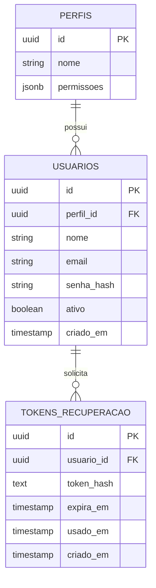
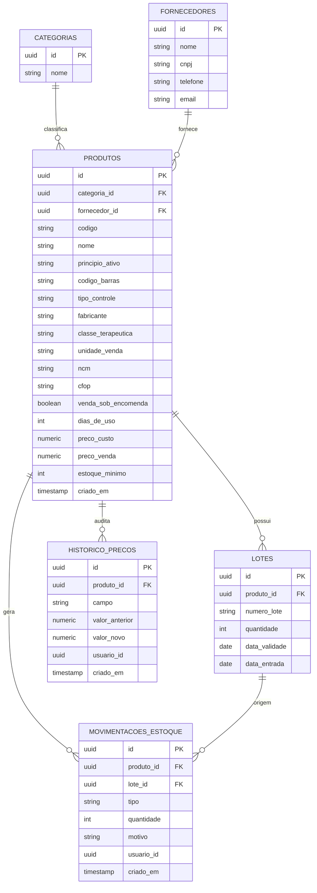
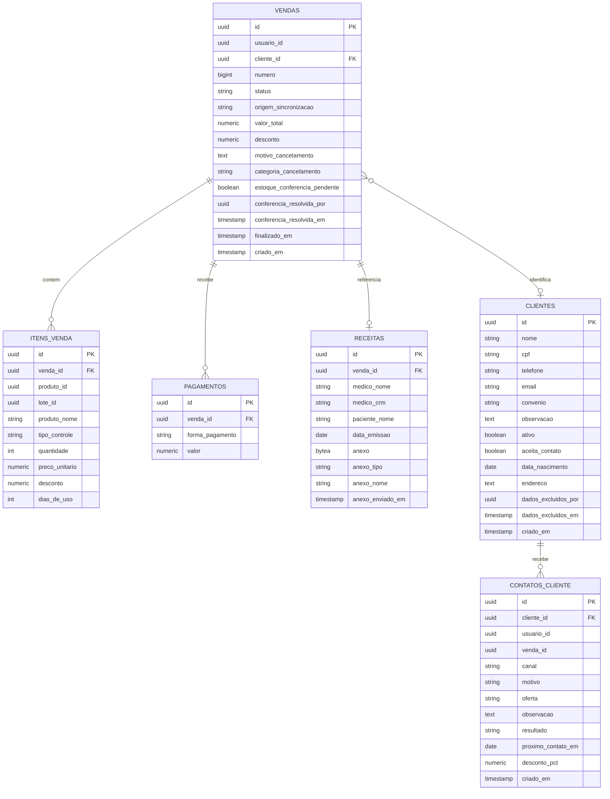
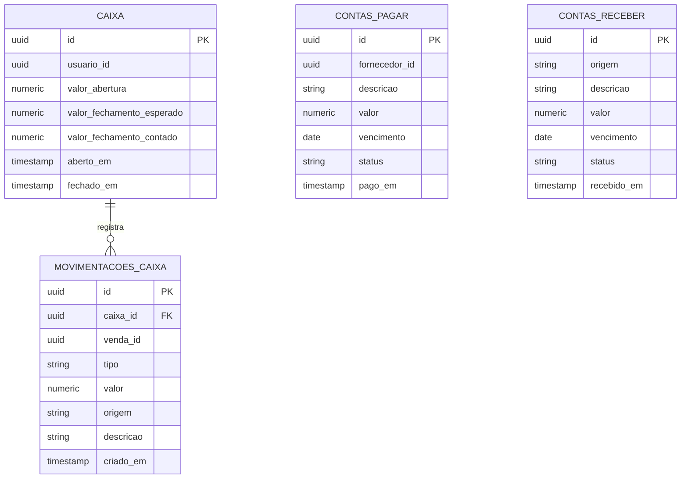
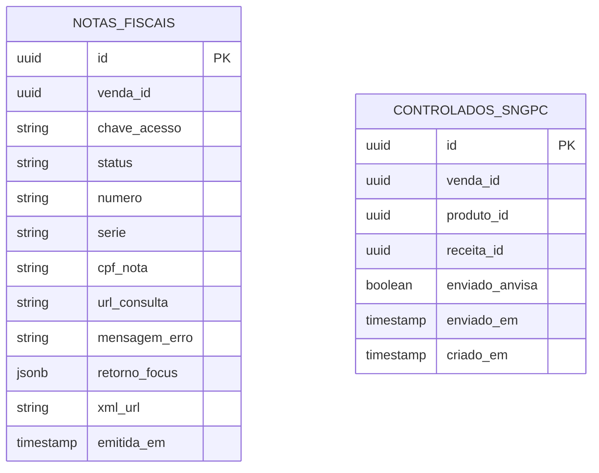
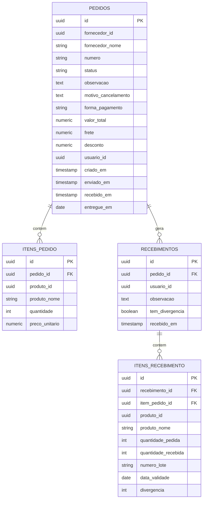

# Arkos — Modelagem de Dados

> Cada módulo tem seu próprio schema lógico no PostgreSQL, mesmo rodando no mesmo processo (ver `docs/ARQUITETURA.md`). Referências entre módulos (ex: `produto_id` dentro de `vendas`) são **por ID apenas — sem FK real entre schemas**, porque um módulo nunca acessa a tabela de outro diretamente, só via API.
>
> `database/schema/*.md` (gerado por `sync-schema.js`, nunca editado à mão) é a fonte de verdade para a lista exata de colunas, tipos, nulabilidade e defaults de cada tabela — sempre reflete o banco real. Este documento não repete isso: ele mostra os **relacionamentos** (ERD) e o **significado de negócio** de cada tabela/enum, coisa que o schema gerado não carrega. Se algo aqui divergir do schema gerado, o schema gerado está certo.

---

## `auth`

| Tabela | Campo-chave | Observação |
|---|---|---|
| `perfis` | `nome` | operador_caixa, farmaceutico, gerente, administrador (ver `REGRAS-NEGOCIO.md` §7) |
| `usuarios` | `email` (único) | `senha_hash` nunca em texto plano |
| `tokens_recuperacao` | `token_hash` | hash do token de redefinição de senha (nunca o token em texto puro); `expira_em` controla validade do link, `usado_em` impede reuso |

---

## `estoque`

| Tabela | Campo-chave | Observação |
|---|---|---|
| `produtos.tipo_controle` | enum | `livre`, `tarja_vermelha`, `tarja_preta` — define se exige receita (§1) |
| `produtos.dias_de_uso` | opcional | sugestão de duração do tratamento, usada pelo CRM de recompra (`vendas.contatos_cliente`) |
| `lotes` | `data_validade` | base da regra **FEFO** — saída sempre pelo lote que vence primeiro (§2) |
| `movimentacoes_estoque.tipo` | enum | `entrada`, `saida`, `ajuste`, `perda`, `devolucao` — toda movimentação é auditada (§2) |
| `historico_precos` | 1 produto → N registros | grava toda alteração de `preco_custo`/`preco_venda`/outros campos monetários, com quem alterou |

**Views** (derivadas, sem PK — só leitura):

| View | Uso |
|---|---|
| `vw_estoque_baixo` | produtos com saldo atual abaixo do `estoque_minimo`, para o dashboard de alertas |
| `vw_produtos_a_vencer` | lotes com `dias_para_vencer` calculado, para o dashboard de alertas de validade |

---

## `vendas`

| Tabela | Campo-chave | Observação |
|---|---|---|
| `vendas.status` | enum `status_venda` | `aberta`, `finalizada`, `cancelada` — cancelamento sempre com `motivo_cancelamento` + `categoria_cancelamento` (§3) |
| `vendas.origem_sincronizacao` | enum `origem_venda` | `online` (PDV com conexão) ou `offline` (venda feita no PDV offline e sincronizada depois) |
| `vendas.estoque_conferencia_pendente` | flag | marcada quando uma venda `offline` sincronizada deixou saldo de lote negativo — fica pendente até um gerente conferir (`conferencia_resolvida_por`/`_em`); ver nota de saldo negativo em `REGRAS-NEGOCIO.md` §2 |
| `itens_venda.tipo_controle` | cópia do produto | snapshot do `tipo_controle` do produto no momento da venda (histórico não muda se o cadastro do produto mudar depois) |
| `pagamentos` | 1 venda → N pagamentos | suporta pagamento misto (parte cartão, parte dinheiro) |
| `receitas` | vinculada à venda | obrigatória se algum item for `tarja_vermelha`/`tarja_preta` — sem isso, venda bloqueada (§3) |
| `receitas.anexo` | opcional | foto/scan da receita (retenção física exigida pela RDC 20/2011 para antibiótico) — `bytea`, servido por `GET /vendas/:id/receita/anexo`, nunca embutido no JSON do detalhe da venda |
| `clientes.cpf`/`telefone`/`email`/`endereco`/`data_nascimento` | dados pessoais | sujeitos à LGPD (finalidade: identificação para venda/convênio e relacionamento) — coleta e uso devem se limitar a essa finalidade; `aceita_contato` é o registro de consentimento para o CRM de recompra, e deve ser respeitado antes de qualquer contato em `contatos_cliente` |
| `clientes.dados_excluidos_por`/`dados_excluidos_em` | direito de exclusão (LGPD) | preenchidos por `POST /vendas/clientes/:id/excluir-dados` ou pela retenção automática (`npm run retencao:clientes`, 2 anos sem compra) — quando não-nulos, os demais campos pessoais da linha já foram anonimizados, mas o `id` permanece para não quebrar `vendas`/`itens_venda`/`contatos_cliente` que referenciam esse cliente |
| `contatos_cliente.resultado` | enum `resultado_contato` | `aguardando`, `interessado`, `sem_interesse`, `nao_atendeu`, `convertido` — fecha o ciclo do CRM de recompra |
| `contatos_cliente.canal` | enum `canal_contato` | `telefone`, `whatsapp`, `email`, `presencial` |

**Views**:

| View | Uso |
|---|---|
| `vw_vendas_hoje` | `total_vendas`, `valor_total_dia`, `ticket_medio` do dia local (`TZ_NEGOCIO`) — alimenta o dashboard |

---

## `financeiro`

| Tabela | Campo-chave | Observação |
|---|---|---|
| `caixa` | abertura/fechamento | fechamento sempre confere esperado x contado (§5) |
| `movimentacoes_caixa` | gerada automaticamente | toda venda finalizada gera lançamento — nunca manual (§5); `venda_id` referencia a venda de origem por ID (sem FK real — `financeiro` não acessa o schema `vendas` diretamente) |
| `contas_pagar` | `fornecedor_id` | referencia `estoque.fornecedores` por ID; ligado ao fluxo de compras (`compras.pedidos` gera conta a pagar no recebimento) |

---

## `fiscal`

| Tabela | Campo-chave | Observação |
|---|---|---|
| `notas_fiscais` | `status` | `emitida` (autorizada pela SEFAZ) ou `erro` (rejeição/payload incompleto — motivo em `mensagem_erro`); `simulado` é o default histórico da coluna, de antes da integração real com a Focus NFe (§6) |
| `notas_fiscais.cpf_nota` | dado pessoal | CPF do cliente na nota (quando informado na venda) — dado sensível sob a LGPD; finalidade é estritamente fiscal (emissão de NF-e), não deve ser reaproveitado para outro fim sem base legal própria |
| `controlados_sngpc` | `enviado_anvisa` | fica `false` no MVP — campo já existe para quando a integração real for feita; `enviado_em` registra o timestamp do envio quando acontecer |

---

## `compras`

| Tabela | Campo-chave | Observação |
|---|---|---|
| `pedidos.status` | enum `status_pedido` | `rascunho`, `enviado`, `recebido`, `cancelado` |
| `pedidos.numero` | gerado | formato `PC-<ano>-<sequencial>` (sequência própria por schema) |
| `pedidos.fornecedor_id` | referencia | `estoque.fornecedores` por ID (sem FK real entre schemas) |
| `itens_recebimento.divergencia` | calculado | `quantidade_recebida - quantidade_pedida`; `recebimentos.tem_divergencia` sinaliza se algum item do recebimento divergiu — conferência manual antes de dar entrada no estoque (o recebimento gera `estoque.movimentacoes_estoque` e `financeiro.contas_pagar` por HTTP) |

---

## Convenções gerais

- Toda tabela usa `uuid` como chave primária (evita conflito ao gerar IDs em módulos diferentes sem coordenação central).
- Datas de auditoria (`criado_em`, etc.) em `timestamp with time zone`.
- Nenhuma FK cruza schemas de módulos diferentes — só dentro do mesmo módulo. Referências entre módulos são por ID, resolvidas via HTTP quando o dado do outro lado é necessário.
- Campos monetários sempre `numeric(10,2)`, nunca float.
- Colunas com dado pessoal (CPF, telefone, e-mail, endereço, data de nascimento) existem hoje em `vendas.clientes` e `fiscal.notas_fiscais.cpf_nota` — qualquer novo uso desses dados (relatório, exportação, integração) deve respeitar a finalidade original (venda/convênio/nota fiscal) e os princípios de minimização da LGPD, não presumir uso livre só porque o dado já está no banco.
